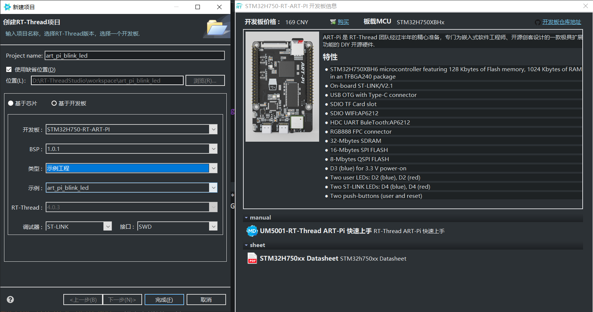
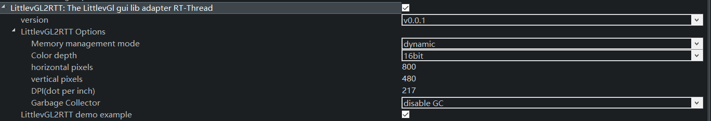
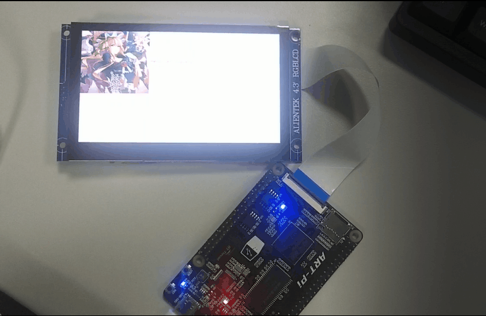

# LittlevGL2RTT 在 ART-PI 上初使用

本篇文章记录了在 ART-PI 上使用 LittlevGL2RTT 软件包并跑通 demo 时所需要注意的事项。

软件包项目地址：[LittlevGL2RTT](https://github.com/liu2guang/LittlevGL2RTT#readme) 

首先在 RT-Thread Studio 创建一个 ART-PI BSP 工程，如下图：



然后再 "RT-Thread Settings" 里打开 LittleGL2RTT 软件包，之后需要完成一些配置：



我的配置选项如上图所示：

- version: v0.0.1
- Memory management mode: dynamic
- Color depth: 16bit

Color depth 即通常所说的 RGB565，RGB888，该软件包好像对 RGB888 支持不太好，所以这里选择 RGB565 的 16bit 。

- horizontal pixels: 800
- vertical pixels: 480

ART-PI 的 RGB 接口兼容正点原子的 LCD 屏，我使用的是正点原子的 4.3 寸 800×480 的 RGB 屏，因此上述两个值分别为 800，480 。

- DPI(dot per inch): 217

这个是需要自己计算的，$\sqrt{800^2+480^2} \div 4.3 = 217$，这里的 800 和 480 是分辨率，4.3 即屏幕的尺寸。

- Garbage Collector: disable GC

没有垃圾回收机制，此处 disable 。

Ctrl + S 保存，等待资源加载完毕。

打开 lcd_port.h 文件，需要在里面修改一些参数：

```C
#define LCD_WIDTH           800
#define LCD_HEIGHT          480
#define LCD_BITS_PER_PIXEL  24
#define LCD_BUF_SIZE        (LCD_WIDTH * LCD_HEIGHT * LCD_BITS_PER_PIXEL / 8)
#define LCD_PIXEL_FORMAT    RTGRAPHIC_PIXEL_FORMAT_RGB888

#define LCD_HSYNC_WIDTH     1
#define LCD_VSYNC_HEIGHT    1
#define LCD_HBP             88
#define LCD_VBP             32
#define LCD_HFP             40
#define LCD_VFP             13
```

实际修改如下：

```C
#define LCD_WIDTH           800
#define LCD_HEIGHT          480
#define LCD_BITS_PER_PIXEL  16//24
#define LCD_BUF_SIZE        (LCD_WIDTH * LCD_HEIGHT * LCD_BITS_PER_PIXEL / 8)
#define LCD_PIXEL_FORMAT    RTGRAPHIC_PIXEL_FORMAT_RGB565//888

#define LCD_HSYNC_WIDTH     1
#define LCD_VSYNC_HEIGHT    1
#define LCD_HBP             40//88
#define LCD_VBP             32
#define LCD_HFP             48//40
#define LCD_VFP             13
```

将 LCD 设置为 RGB565 模式，然后配置屏幕的 HBP, VBP, HFP, VFP。这些参数可以在屏幕的资料里面找到。

编译，下载，然后就可以看见 demo 示例的图片了。



之后我会继续分享一些 LittleGL 的学习经验，希望能帮助一些朋友。

以下为我目前搜集到的 LittleGL 的一些资源：

- [LVGL官方文档](https://docs.lvgl.io/latest/en/html/index.html)
- [LittelvGL学习笔记](https://littlevgl.readthedocs.io/en/latest/index.html)
- [正点原子手把手教你学LittleVGL](http://www.openedv.com/docs/book-videos/zdyzshipin/4free/littleVGL.html)

