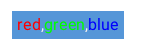
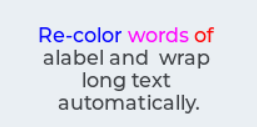
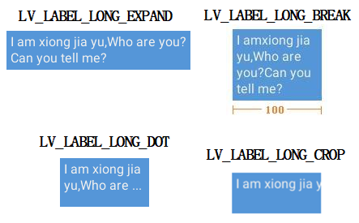
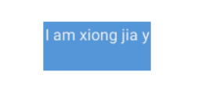
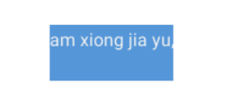

# lvgl - Label 的使用

## Label 基本使用

### 创建 label 对象

```C
lv_obj_t *lv_label_create(lv_obj_t *parent, const lv_obj_t *copy);
```

参数：

- parent: 指向父对象。
- copy: 此参数可选，表示创建新对象时，把 copy 的属性值复制过来。

### 设置显示文本内容

#### 动态文本

所谓动态文本即指传入的字符串或数组在 label 对象里有一份拷贝，会使用动态内存申请，因此传入的数据可以在外部释放。

数据格式可以是以 '\0' 结尾的字符串，也可以是数组，两种接口如下：

```C
void lv_label_set_text(lv_obj_t * label, const char * text);

void lv_label_set_array_text(lv_obj_t * label, const char * array, uint16_t size);
```

还可以使用 

```C
void lv_label_set_text_fmt(lv_obj_t *label, const char *fmt, ...)
```

来格式化文本显示，fmt 是与 printf 一样的格式化数据，该显示文本是动态文本。

#### 静态文本

所谓静态文本是指 label 对象用于显示的文本数据实际保存在外部，因此传入的数据不可以释放，最好是静态变量。

数据格式可以是以 '\0' 结尾的字符串，也可以是数组，两种接口如下：

```C
void lv_label_set_static_text(lv_obj_t * label, const char * text);

void lv_label_set_array_text(lv_obj_t * label, const char * array, uint16_t size);
```

此处 text 和 array 里的内容不能随意释放，否则会造成 label 对象的显示出错。

*上述设置文本的接口，若传入的数据为 NULL，则代表刷新当前文本内容。*

## Label 进阶使用

### 文本重绘色

在显示文本中，可以使用命令来重绘色部分文本。使用格式如下：`#16进制颜色值 文本# `。重绘色以 `#16进制颜色值`  开始，以 `#` 结束，中间的 `文本` 就会被重绘色。

- `16进制颜色值` 即由 r,g,b 三通道，每个通道 1 字节组成，一共有 3 个字节。例如 `FF0000: r:0xFF, g:0x00, b: 0x00` 。
- 注意颜色值与文本直接至少有一个空格。

在对一个 label 对象使用重绘色功能之前，需要先使能重绘色功能，接口如下：

```C
void lv_label_set_recolor(lv_obj_t * label, bool en);
```

例程如下：

```C
lv_label_set_recolor(label1, true);//先得使能文本重绘色功能
lv_label_set_text(label1, "#ff0000 red#,#00ff00 green#,#0000ff blue#");//使用了 3 次重绘色
```



文本重绘色仅工作于单行，因此若在文本中出现了 '\n' ，或文本被 LV_LABEL_LONG_BREAK 换行了，新行的文本不会被重绘色。

例如：

```C
lv_label_set_long_mode(label1, LV_LABEL_LONG_BREAK);     /*Break the long lines*/
lv_label_set_recolor(label1, true);       /*Enable re-coloring by commands in the text*/
lv_label_set_text(label1, "#0000ff Re-color# #ff00ff words# #ff0000 of a# label "
                          "and  wrap long text automatically.");
```



该结果里 `of` 字符后面被 LV_LABEL_LONG_BREAK 换行了，于是后一个字符 `a` 就没有被重绘为红色。

### 长文本模式

label 对象一共有如下几种长文本模式：

```C
enum {
    LV_LABEL_LONG_EXPAND, 	//自动扩展对象的大小来包裹文本内容
    
    LV_LABEL_LONG_BREAK,	//保持对象的宽度不变,当文本内容的宽度超过对象的宽度时会自动换行,							然后同时自动扩展对象的高度来包裹文本内容的高度
    LV_LABEL_LONG_DOT,		//保持对象的大小不变,当文本内容太长显示不下时,会在文本末尾显示...						  三个点的省略号
    LV_LABEL_LONG_SROLL,	//保持对象的大小不变,当文本内容太长显示不下时,会自动循环向前向后							滚动文本
    LV_LABEL_LONG_SROLL_CIRC,//保持对象的大小不变,当文本内容太长显示不下时,会自动循环环形滚动							 文本
    LV_LABEL_LONG_CROP, 	//保持对象大小不变,超过的文本内容将会被剪切掉
};
typedef uint8_t lv_label_long_mode_t;
```

使用如下接口设置模式 `lv_label_set_long_mode(label, LV_LABEL_LONG_...)` 。

示例如下：

```C
lv_label_set_text(label2, "I am xiong jia yu,Who are you?Can you tell me?");
```

不同模式下的显示效果如下所示：



LV_LABEL_LONG_SROLL:



LV_LABEL_LONG_SROLL_CIRC:



SROLL_CIRC 模式有一点像路边的灯光招牌和出租车上的广告一样，循环显示。还可以用如下接口调节动画的速度：

```C
void lv_label_set_anim_speed(lv_obj_t * label, uint16_t anim_speed);
```

不同的长文本模式对 label 对象的大小也有影响。"EXPAND" 会使对象的 width 和 height 都无效；"BREAK" 会使对象的 height 无效，width 有效；剩余的模式 "DOT", "CROP", "SROLL", "SROLL_CIRC" 其对象 width 和 height 都有效。

### 文本对齐

一共有三种对齐方式：

```C
enum {
    LV_LABEL_ALIGN_LEFT, 	//文本左对齐
    LV_LABEL_ALIGN_CENTER, 	//文本居中对齐
    LV_LABEL_ALIGN_RIGHT,	//文本右对齐
};
typedef uint8_t lv_label_align_t;
```

使用如下接口来设置：

```C
void lv_label_set_align(lv_obj_t * label, lv_label_align_t align);  
```