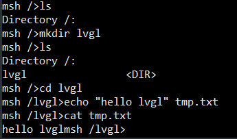
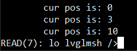

# LVGL 文件系统移植

## 文件系统介绍

在 LVGL 里可以将图像以文件的形式存储在 SPI Flash 或 SD 卡上，但是必须存储在 LVGL 的文件系统里，因此实践移植了 LVGL 文件系统。

LVGL 的文件系统可以适配任何其他的文件系统，只要实现相应的回调函数即可。该文件系统有一个驱动字符（drive letter）用于识别不同设备，例如 SD 卡可以与驱动字符 'S' 相关联，这样可以通过路径 `"S:/path/to/file.txt"` 来访问一个文件。

### 添加驱动

为了添加文件系统的驱动，需要初始化一个 `lv_fs_drv_t` 的结构体，类似下列示例代码：

```C
lv_fs_drv_t drv;
lv_fs_drv_init(&drv);                     /*Basic initialization*/

drv.letter = 'S';                         /*An uppercase letter to identify the drive */
drv.file_size = sizeof(my_file_object);   /*Size required to store a file object*/
drv.rddir_size = sizeof(my_dir_object);   /*Size required to store a directory object (used by dir_open/close/read)*/
drv.ready_cb = my_ready_cb;               /*Callback to tell if the drive is ready to use */
drv.open_cb = my_open_cb;                 /*Callback to open a file */
drv.close_cb = my_close_cb;               /*Callback to close a file */
drv.read_cb = my_read_cb;                 /*Callback to read a file */
drv.write_cb = my_write_cb;               /*Callback to write a file */
drv.seek_cb = my_seek_cb;                 /*Callback to seek in a file (Move cursor) */
drv.tell_cb = my_tell_cb;                 /*Callback to tell the cursor position  */
drv.trunc_cb = my_trunc_cb;               /*Callback to delete a file */
drv.size_cb = my_size_cb;                 /*Callback to tell a file's size */
drv.rename_cb = my_rename_cb;             /*Callback to rename a file */

drv.dir_open_cb = my_dir_open_cb;         /*Callback to open directory to read its content */
drv.dir_read_cb = my_dir_read_cb;         /*Callback to read a directory's content */
drv.dir_close_cb = my_dir_close_cb;       /*Callback to close a directory */

drv.free_space_cb = my_free_space_cb;     /*Callback to tell free space on the drive */

drv.user_data = my_user_data;             /*Any custom data if required*/

lv_fs_drv_register(&drv);                 /*Finally register the drive*/
```

上述的任何一个回调函数都可以为 NULL 表明该操作不支持。

举例说明一些这些回调函数是如何被使用的，如果我们执行操作：

```C
lv_fs_open(&file, "S:/folder/file.txt", LV_FS_MODE_WR);
```

LVGL 会依次

1. 检查已经注册的驱动其驱动字节是否为 `'s'` 。
2. 检查 `open_cb` 回调函数是否被实现（不为 NULL）。
3. 调用 `open_cb`，其中 path 参数为 `"folder/file.txt"` 。

### 使用示例

以下代码演示了如何读取文件：

```C
lv_fs_file_t f;
lv_fs_res_t res;
res = lv_fs_open(&f, "S:folder/file.txt", LV_FS_MODE_RD);
if(res != LV_FS_RES_OK) my_error_handling();

uint32_t read_num;
uint8_t buf[8];
res = lv_fs_read(&f, buf, 8, &read_num);
if(res != LV_FS_RES_OK || read_num != 8) my_error_handling();

lv_fs_close(&f);
```

`lv_fs_open` 里的 mode 参数也可以是 `LV_FS_MODE_WR` 或 `LV_FS_MODE_WR | LV_FS_MODE_RD` 。

下面的例子展示了如何读取一个目录里的内容。由驱动程序决定如何标记目录，类似 Unix 风格，最好在目录名称前面插入 `'/'` 表明根目录。

```C
lv_fs_dir_t dir;
lv_fs_res_t res;
res = lv_fs_dir_open(&dir, "S:/folder");
if(res != LV_FS_RES_OK) my_error_handling();

char fn[256];
while(1) {
    res = lv_fs_dir_read(&dir, fn);
    if(res != LV_FS_RES_OK) {
        my_error_handling();
        break;
    }

    /*fn is empty, if not more files to read*/
    if(strlen(fn) == 0) {
        break;
    }

    printf("%s\n", fn);
}

lv_fs_dir_close(&dir);
```

### 图像所使用的驱动程序

LVGL 的 image 对象可以从文件里打开（另一种方式是直接存储在 Flash）。

为了初始化图像，需要以下回调函数的支持：

- open_cb
- close_cb
- read_cb
- seek_cb
- tell_cb

## 移植

因为移植这个文件系统主要是为了存储并打开图像文件，因此没必要完全实现，只需实现 open, close, read, seek, tell 这五个回调函数即可。

本次移植之前需要在 RT-Thread 里成功移植了 SD 卡，并挂载了虚拟文件系统 DFS，可以参考：[RT-Thread Studio驱动SD卡](https://blog.csdn.net/weixin_37875741/article/details/109733737) 。

RT-Thread 的 [DFS](https://www.rt-thread.org/document/site/programming-manual/filesystem/filesystem/) 实现了 POSIX 接口，因此可以使用 POSIX 的 open, close, read, lseek 这些操作文件的 API，大大简化了移植 LVGL 文件系统的事件。

这些接口的使用可以参考 [RT-Thread 文档 ](https://www.rt-thread.org/document/site/programming-manual/filesystem/filesystem/#_11)。

在 port 目录下有一个官方提供的移植模板文件 `lv_port_fs_template.c`，这里面提供了移植的步骤，以及需要实现的部分。

### 类型定义

模板文件里相关内容如下：

```C
/**********************
 *      TYPEDEFS
 **********************/

/* Create a type to store the required data about your file.
 * If you are using a File System library
 * it already should have a File type.
 * For example FatFS has `FIL`. In this case use `typedef FIL file_t`*/
typedef struct {
    /*Add the data you need to store about a file*/
    uint32_t dummy1;
    uint32_t dummy2;
}file_t;

/*Similarly to `file_t` create a type for directory reading too */
typedef struct {
    /*Add the data you need to store about directory reading*/
    uint32_t dummy1;
    uint32_t dummy2;
}dir_t;
```

根据提示，file_t 是一个类似句柄的类型，就比如 FatFS 里的 FIL 以及 POSIX 里的 int 。而且我们目前只需要操作文件，不需要操作目录，因此上述内容就可以更改为：

```C
typedef int file_t;
```

### 函数申明

其次是函数声明的部分：

```C
/**********************
 *  STATIC PROTOTYPES
 **********************/
static void fs_init(void);

static lv_fs_res_t fs_open (lv_fs_drv_t * drv, void * file_p, const char * path, lv_fs_mode_t mode);
static lv_fs_res_t fs_close (lv_fs_drv_t * drv, void * file_p);
static lv_fs_res_t fs_read (lv_fs_drv_t * drv, void * file_p, void * buf, uint32_t btr, uint32_t * br);
static lv_fs_res_t fs_write(lv_fs_drv_t * drv, void * file_p, const void * buf, uint32_t btw, uint32_t * bw);
static lv_fs_res_t fs_seek (lv_fs_drv_t * drv, void * file_p, uint32_t pos);
static lv_fs_res_t fs_size (lv_fs_drv_t * drv, void * file_p, uint32_t * size_p);
static lv_fs_res_t fs_tell (lv_fs_drv_t * drv, void * file_p, uint32_t * pos_p);
static lv_fs_res_t fs_remove (lv_fs_drv_t * drv, const char *path);
static lv_fs_res_t fs_trunc (lv_fs_drv_t * drv, void * file_p);
static lv_fs_res_t fs_rename (lv_fs_drv_t * drv, const char * oldname, const char * newname);
static lv_fs_res_t fs_free (lv_fs_drv_t * drv, uint32_t * total_p, uint32_t * free_p);
static lv_fs_res_t fs_dir_open (lv_fs_drv_t * drv, void * rddir_p, const char *path);
static lv_fs_res_t fs_dir_read (lv_fs_drv_t * drv, void * rddir_p, char *fn);
static lv_fs_res_t fs_dir_close (lv_fs_drv_t * drv, void * rddir_p);
```

较老版本的移植模板文件这些函数可能没有第一个参数 `lv_fs_drv_t * drv`，需要自己添加。

删除不必要的接口，只保留我们需要的部分，如下所示：

```C
static void fs_init(void);

static lv_fs_res_t fs_open (lv_fs_drv_t * drv, void * file_p, const char * path, lv_fs_mode_t mode);
static lv_fs_res_t fs_close (lv_fs_drv_t * drv, void * file_p);
static lv_fs_res_t fs_read (lv_fs_drv_t * drv, void * file_p, void * buf, uint32_t btr, uint32_t * br);
static lv_fs_res_t fs_seek (lv_fs_drv_t * drv, void * file_p, uint32_t pos);
static lv_fs_res_t fs_tell (lv_fs_drv_t * drv, void * file_p, uint32_t * pos_p);
```

### 初始化函数

```C
void lv_port_fs_init(void)
{
    /*----------------------------------------------------
     * Initialize your storage device and File System
     * -------------------------------------------------*/
    fs_init();

    /*---------------------------------------------------
     * Register the file system interface  in LittlevGL
     *--------------------------------------------------*/

    /* Add a simple drive to open images */
    lv_fs_drv_t fs_drv;                         /*A driver descriptor*/
    memset(&fs_drv, 0, sizeof(lv_fs_drv_t));    /*Initialization*/

    /*Set up fields...*/
    fs_drv.file_size = sizeof(file_t);
    fs_drv.letter = 'P';
    fs_drv.open = fs_open;
    fs_drv.close = fs_close;
    fs_drv.read = fs_read;
    fs_drv.write = fs_write;
    fs_drv.seek = fs_seek;
    fs_drv.tell = fs_tell;
    fs_drv.free = fs_free;
    fs_drv.size = fs_size;
    fs_drv.remove = fs_remove;
    fs_drv.rename = fs_rename;
    fs_drv.trunc = fs_trunc;

    fs_drv.rddir_size = sizeof(dir_t);
    fs_drv.dir_close = fs_dir_close;
    fs_drv.dir_open = fs_dir_open;
    fs_drv.dir_read = fs_dir_read;

    lv_fs_add_drv(&fs_drv);
}
```

初始化函数这里会注册设备，设备描述符 `fs_drv` 经过默认初始化后所有的回调函数都为 NULL，因此没有回调函数的成员可以不用管。修改成如下内容：

```C
int lv_port_fs_init(void)
{
    /*----------------------------------------------------
     * Initialize your storage device and File System
     * -------------------------------------------------*/
    fs_init();

    /*---------------------------------------------------
     * Register the file system interface  in LittlevGL
     *--------------------------------------------------*/

    /* Add a simple drive to open images */
    lv_fs_drv_t fs_drv;                         /*A driver descriptor*/
    lv_fs_drv_init(&fs_drv);                    /*Basic initialization*/

    /*Set up fields...*/
    fs_drv.file_size = sizeof(file_t);
    fs_drv.letter = 'S';
    fs_drv.open_cb = fs_open;
    fs_drv.close_cb = fs_close;
    fs_drv.read_cb = fs_read;
    fs_drv.seek_cb = fs_seek;
    fs_drv.tell_cb = fs_tell;

    lv_fs_drv_register(&fs_drv);

    return RT_EOK;
}
```

这个初始化函数需要在 LVGL 初始化之后再调用。

### 回调接口实现

#### fs_init

该函数本来是为了用户初始化 SD 卡或 Flash，但我们的 SD 卡或 Flash 在外部已经初始化好了，因此这里默认不管即可。

#### fs_open

在这个接口里我们需要按照 mode 模式打开文件，由于我们只需要读文件，因此只实现 LV_FS_MODE_RD 的部分即可，模板文件内容如下：

```C
/**
 * Open a file
 * @param drv pointer to a driver where this function belongs
 * @param file_p pointer to a file_t variable
 * @param path path to the file beginning with the driver letter (e.g. S:/folder/file.txt)
 * @param mode read: FS_MODE_RD, write: FS_MODE_WR, both: FS_MODE_RD | FS_MODE_WR
 * @return LV_FS_RES_OK or any error from lv_fs_res_t enum
 */
static lv_fs_res_t fs_open (lv_fs_drv_t * drv, void * file_p, const char * path, lv_fs_mode_t mode)
{
    lv_fs_res_t res = LV_FS_RES_NOT_IMP;

    if(mode == LV_FS_MODE_WR)
    {
        /*Open a file for write*/

        /* Add your code here*/
    }
    else if(mode == LV_FS_MODE_RD)
    {
        /*Open a file for read*/

        /* Add your code here*/
    }
    else if(mode == (LV_FS_MODE_WR | LV_FS_MODE_RD))
    {
        /*Open a file for read and write*/

        /* Add your code here*/
    }

    return res;
}
```

函数参数 `file_p` 就是之前定义的 `file_t` 类型的指针，在实际移植过程中需要用相应的句柄去填充 `file_p` 所指向的内容，因为后面实现其他接口时都是通过 `file_p` 这个参数来传递句柄。这里我填充了 POSIX 的 int 类型句柄：

```C
int fd;
*(file_t *)file_p = fd;
```

一般 SD 卡或 Flash 都是挂载在 `'/'` 目录下的，为了与其他内容区分开，我这里将 LVGL 打开文件的起始地址导向了 `'/lvgl/'` 目录下，也就是说 `lv_fs_open(&f, "S:/file.txt", LV_FS_MODE_RD);` 实际是调用了 `open("/lvgl/file.txt", O_RDONLY)` 这个函数。将 LVGL 的默认目录定义为 `'/lvgl/'`，也可以理解为将 LVGL 的文件系统挂载到 `'/lvgl/'` 目录下了。

移植后内容如下：

```Cc
static lv_fs_res_t fs_open (lv_fs_drv_t * drv, void * file_p, const char * path, lv_fs_mode_t mode)
{
    lv_fs_res_t res = LV_FS_RES_NOT_IMP;
    
    rt_size_t len = rt_strlen(path);
    RT_ASSERT(len < DFS_PATH_MAX);

    char posix_path[DFS_PATH_MAX] = "/lvgl/";
    const char *lvgl_dir_path = path;
    strncat(posix_path, lvgl_dir_path, DFS_PATH_MAX-6);

    int fd;
    if(mode == LV_FS_MODE_RD)
    {
        /*Open a file for read*/
        if ((fd = open(posix_path, O_RDONLY)) > 0) {
            *(file_t *)file_p = fd;
            res = LV_FS_RES_OK;         // open success
        } else {
            res = LV_FS_RES_NOT_EX;     // open fail
        }
    }

    return res;
}
```

#### fs_close

模板示例如下：

```C
/**
 * Close an opened file
 * @param drv pointer to a driver where this function belongs
 * @param file_p pointer to a file_t variable. (opened with lv_ufs_open)
 * @return LV_FS_RES_OK: no error, the file is read
 *         any error from lv_fs_res_t enum
 */
static lv_fs_res_t fs_close (lv_fs_drv_t * drv, void * file_p)
{
    lv_fs_res_t res = LV_FS_RES_NOT_IMP;

    /* Add your code here*/

    return res;
}
```

这个接口需要关闭打开的文件，因此直接调用 close 即可，用 `int fd = *(file_t *)file_p` 将 `file_p` 强制转换为 POSIX 的 int 型句柄，移植如下：

```C
static lv_fs_res_t fs_close (lv_fs_drv_t * drv, void * file_p)
{
    lv_fs_res_t res = LV_FS_RES_UNKNOWN;

    int fd = *(file_t *)file_p;
    if (close(fd) == 0)
        res = LV_FS_RES_OK;         // close success

    return res;
}
```

#### fs_read

模板示例如下：

```C
/**
 * Read data from an opened file
 * @param drv pointer to a driver where this function belongs
 * @param file_p pointer to a file_t variable.
 * @param buf pointer to a memory block where to store the read data
 * @param btr number of Bytes To Read
 * @param br the real number of read bytes (Byte Read)
 * @return LV_FS_RES_OK: no error, the file is read
 *         any error from lv_fs_res_t enum
 */
static lv_fs_res_t fs_read (lv_fs_drv_t * drv, void * file_p, void * buf, uint32_t btr, uint32_t * br)
{
    lv_fs_res_t res = LV_FS_RES_NOT_IMP;

    /* Add your code here*/

    return res;
}
```

需要从文件里读出最大 btr 个字节到缓冲区 buf 里，实际读取的字节通过 br 返回。移植如下：

```C
static lv_fs_res_t fs_read (lv_fs_drv_t * drv, void * file_p, void * buf, uint32_t btr, uint32_t * br)
{
    lv_fs_res_t res = LV_FS_RES_UNKNOWN;

    int fd = *(file_t *)file_p;
    int read_bytes = read(fd, buf, btr);
    if (read_bytes >= 0) {
        *br = read_bytes;
        res = LV_FS_RES_OK;
    }
    
    return res;
}
```

#### fs_seek

模板示例如下：

```C
/**
 * Set the read write pointer. Also expand the file size if necessary.
 * @param drv pointer to a driver where this function belongs
 * @param file_p pointer to a file_t variable. (opened with lv_ufs_open )
 * @param pos the new position of read write pointer
 * @return LV_FS_RES_OK: no error, the file is read
 *         any error from lv_fs_res_t enum
 */
static lv_fs_res_t fs_seek (lv_fs_drv_t * drv, void * file_p, uint32_t pos)
{
    lv_fs_res_t res = LV_FS_RES_NOT_IMP;

    /* Add your code here*/

    return res;
}
```

该函数将文件的读写流移动到距文件开始的 pos 个字节处。很容易用 lseek 实现：

```C
static lv_fs_res_t fs_seek (lv_fs_drv_t * drv, void * file_p, uint32_t pos)
{
    lv_fs_res_t res = LV_FS_RES_UNKNOWN;

    int fd = *(file_t *)file_p;
    if (lseek(fd, pos, SEEK_SET) >= 0)
        res = LV_FS_RES_OK;

    return res;
}
```

#### fs_tell

模板示例如下：

```C
/**
 * Give the position of the read write pointer
 * @param drv pointer to a driver where this function belongs
 * @param file_p pointer to a file_t variable.
 * @param pos_p pointer to to store the result
 * @return LV_FS_RES_OK: no error, the file is read
 *         any error from lv_fs_res_t enum
 */
static lv_fs_res_t fs_tell (lv_fs_drv_t * drv, void * file_p, uint32_t * pos_p)
{
    lv_fs_res_t res = LV_FS_RES_NOT_IMP;

    /* Add your code here*/

    return res;
}
```

该函数需要得到文件当前的读写流的位置，也可以用 lseek 来实现：

```C
static lv_fs_res_t fs_tell (lv_fs_drv_t * drv, void * file_p, uint32_t * pos_p)
{
    lv_fs_res_t res = LV_FS_RES_UNKNOWN;

    int fd = *(file_t *)file_p;
    off_t pos = lseek(fd, 0, SEEK_CUR);
    if (pos >= 0) {
        *pos_p = pos;
        res = LV_FS_RES_OK;
    }

    return res;
}
```

## 测试

如何检验我们是否移植成功呢？需要测试一下了。

我使用的测试代码如下，用到了上述所有回调接口，初始化完成之后就可以调用进行测试了。

注意：此时文件系统里需有 `/lvgl/tmp.txt` 这个文件。

```C
#include "lvgl/lvgl.h"

long lv_tell(lv_fs_file_t *fd)
{
    uint32_t pos = 0;
    lv_fs_tell(fd, &pos);
    rt_kprintf("\tcur pos is: %d\n", pos);
    return pos;
}

void lvgl_fs_test(void)
{
    char rbuf[30] = {0};
    uint32_t rsize = 0;
    lv_fs_file_t fd;
    lv_fs_res_t res;

    res = lv_fs_open(&fd, "S:/tmp.txt", LV_FS_MODE_RD);
    if (res != LV_FS_RES_OK) {
        rt_kprintf("open S:/tmp.txt ERROR\n");
        return ;
    }
    lv_tell(&fd);

    lv_fs_seek(&fd, 3);
    lv_tell(&fd);

    res = lv_fs_read(&fd, rbuf, 100, &rsize);
    if (res != LV_FS_RES_OK) {
        rt_kprintf("read ERROR\n");
        return ;
    }
    lv_tell(&fd);
    rt_kprintf("READ(%d): %s",rsize , rbuf);

    lv_fs_close(&fd);
}
```

可以进行如下操作得到这个文件：



然后复位开发板，可以看到如下现象：



此时说明文件系统移植成功。