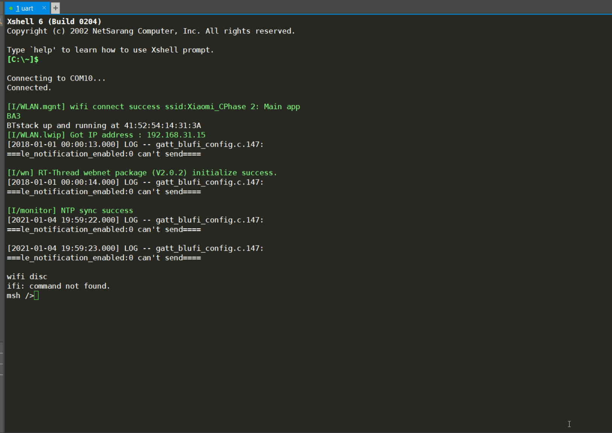

# ART-PI WLAN 连接

本文章关注于 ART-PI-FACTORY 例程里蓝牙配网过程中 WLAN 设备框架的使用。

WLAN 框架的使用请参考：[WLAN 设备框架](https://www.rt-thread.org/document/site/programming-manual/device/wlan/wlan/#finsh) 。

RT-Thread 推出 WLAN 设备框架是为了统一控制和管理 WiFi 的众多功能，本例程可以演示 WiFi **连接功能**，以及断线**自动连接**功能。

## WiFi 连接功能

该功能实现在 `modules/wifi/wifi.c` 文件里。

蓝牙配网的具体流程可以参考：[ART-PI开发板蓝牙配网流程分析](https://supperthomas-wiki.readthedocs.io/en/latest/03_xupenghu/05_art-pi_ble_netin/art-pi_net_connect_with_ble.html) ，这里我主要分析下 WLAN 连网的操作。

首先在 `wifi_init()` 的函数里

```C
int wifi_init(void)
{
    rt_memset(&wifi, 0, sizeof(wifi));
    rt_wlan_register_event_handler(RT_WLAN_EVT_READY, wifi_ready_handler, NULL);
    return 0;
}
```

注册了 `RT_WLAN_EVT_READY` 事件的回调函数 `wifi_ready_handler()` 。WLAN 框架提供了很多事件，用户可以注册相应事件的回调函数，由 WLAN 框架来异步通知它，使用 `rt_wlan_register_event_handler()` 函数来注册事件的回调函数。

这里注册了“连接就绪”事件，也就是连接上 WiFi 后，路由器给 ART-PI 分配了 IP 地址，ART-PI 能够直接跟互联网通信了。

在其回调函数里只是获取了当前的 IP 地址并通过 BLE 发了出去，就不在此介绍了。

ART-PI 如何知道路由器 WiFi 的 ssid 和 password 呢？

这就涉及到蓝牙配网的具体步骤了，手机端首先通过蓝牙与 ART-PI 相连，在微信小程序手动输入 WiFi 的 ssid 和 password，以 json 字符串的形式通过蓝牙发送给 ART-PI，ART-PI 解析出其中的 ssid 和 password 再通过 WLAN 框架连接 WiFi 。

代码里面就是 `wifi_connect()` 函数了，该函数由蓝牙模块调用，并传入带有 ssid 和 passwd 的 json 字符串。

```C
int wifi_connect(char *conn_str)
{
    cJSON *conn = cJSON_Parse(conn_str);
    if (conn)
    {
        cJSON *ssid = cJSON_GetObjectItem(conn, "ssid");
        cJSON *passwd = cJSON_GetObjectItem(conn, "passwd");

        rt_memcpy(wifi.ssid, ssid->valuestring, rt_strlen(ssid->valuestring));
        rt_memcpy(wifi.passwd, passwd->valuestring, rt_strlen(passwd->valuestring));
        return rt_wlan_connect(wifi.ssid, wifi.passwd);
		......
    }
	......
}
```

很明显，解析出 ssid 和 passwd 后直接调用 `rt_wlan_connect()` 建立连接。连接建立成功后，等到连接就绪后就会调用之前注册的回调函数。

## WiFi 自动重连

WLAN 打开自动连接功能后，只要 WiFi 处在断线状态，就会自动读取之前连接成功的热点信息，连接热点。

相应的接口为：

| **函数**                         | **描述**          |
| -------------------------------- | ----------------- |
| rt_wlan_config_autoreconnect()   | 启动/停止自动重连 |
| rt_wlan_get_autoreconnect_mode() | 获取自动重连模式  |

ART-PI-FACTORY 这个例程移植了自动重连的功能，但并未使用，需要我们手动修改一下。

首先在 `modules/wifi/wifi.c` 文件里的 `wifi_init()` 函数修改成如下代码：

```C
int wifi_init(void)
{
    rt_memset(&wifi, 0, sizeof(wifi));
#ifdef RT_WLAN_AUTO_CONNECT_ENABLE
    rt_wlan_config_autoreconnect(RT_TRUE);
#endif
    rt_wlan_register_event_handler(RT_WLAN_EVT_READY, wifi_ready_handler, NULL);
    return 0;
}
```

主要是调用了 `rt_wlan_config_autoreconnect(RT_TRUE);` 函数，使能自动重连。

然后在 `board/port/wifi_config.c` 文件里，将 `wlan_autoconnect_init()` 自动初始化，如下述代码：

```C
void wlan_autoconnect_init(void)
{
    fal_init();
    easyflash_init();

    rt_wlan_cfg_set_ops(&ops);
    rt_wlan_cfg_cache_refresh();
}
INIT_APP_EXPORT(wlan_autoconnect_init);
```

编译，下载，就可以尝试自动重连的功能了。

效果如下，断开连接后 2 秒钟自动重连。

